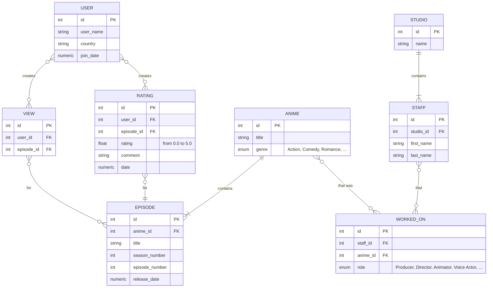

```mermaid
erDiagram
    ANIME {
        int id PK
        string title
        enum genre "Action, Comedy, Romance, ..."
    }
    
    EPISODE {
        int id PK
        int anime_id FK
        string title
        int season_number
        int episode_number
        numeric release_date
    }
    
    USER {
        int id PK
        string user_name
        string country
        numeric join_date
    }

    VIEW {
        int id PK
        int user_id FK
        int episode_id FK
    }

    RATING {
        int id PK
        int user_id FK
        int episode_id FK
        float rating "from 0.0 to 5.0"
        string comment
        numeric date
    }

    STUDIO {
        int id PK
        string name
    }

    STAFF {
        int id PK
        int studio_id FK
        string first_name
        string last_name
    }

    WORKED_ON {
        int id PK
        int staff_id FK
        int anime_id FK
        enum role "Producer, Director, Animator, Voice Actor, ..."
    }

    USER many to many RATING : "creates"
    USER many to many VIEW  : "creates"
    VIEW many to many EPISODE : "for"
    RATING zero or many to one EPISODE : "for"
    ANIME one to one or many EPISODE : "contains"
    STUDIO one to one or many STAFF : "contains"
    ANIME many to many WORKED_ON : "that was"
    STAFF many to many WORKED_ON : "that"
```
